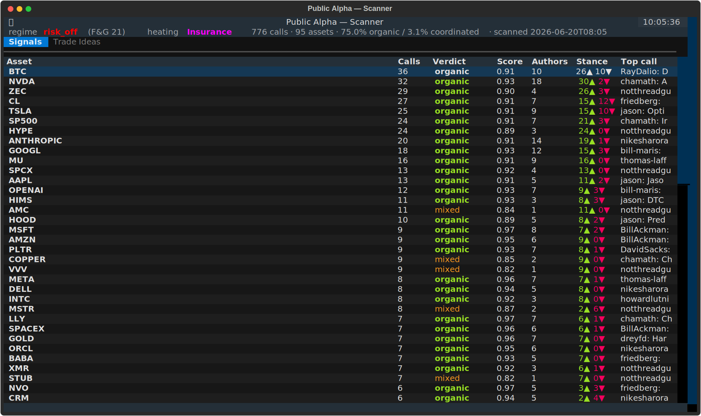
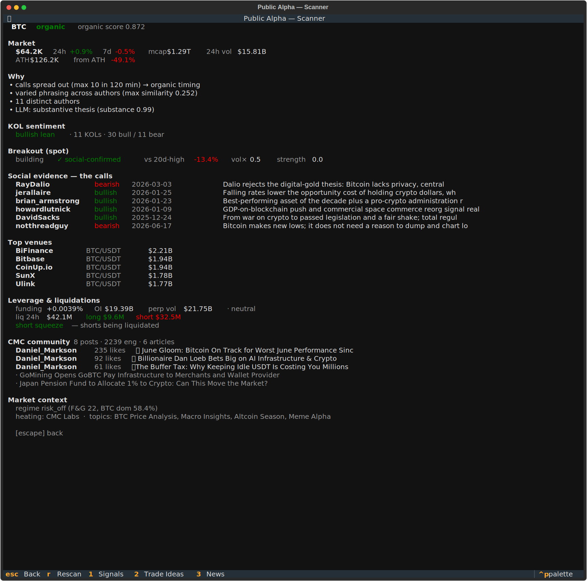
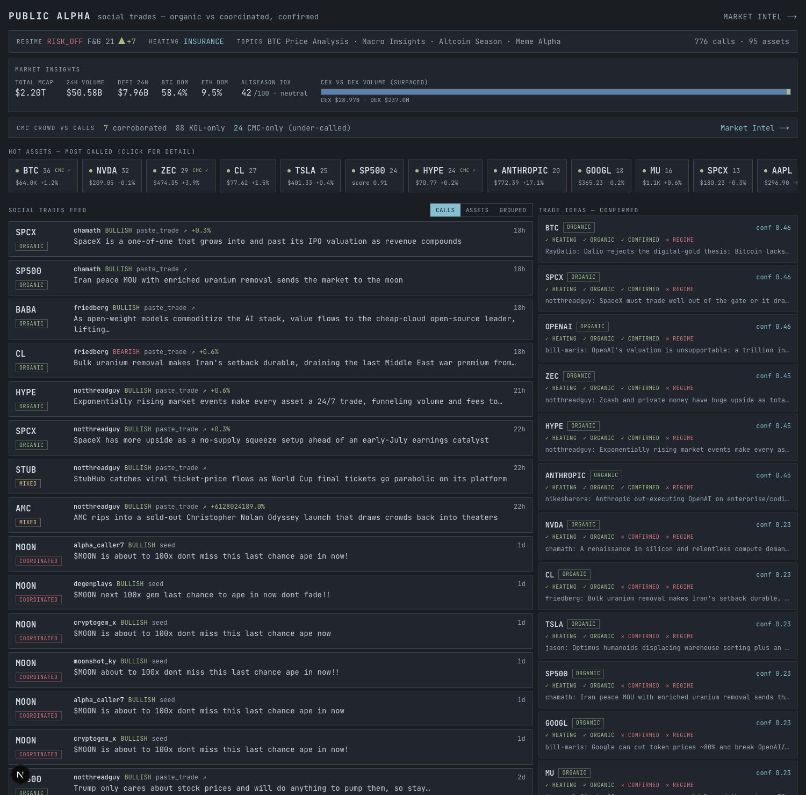
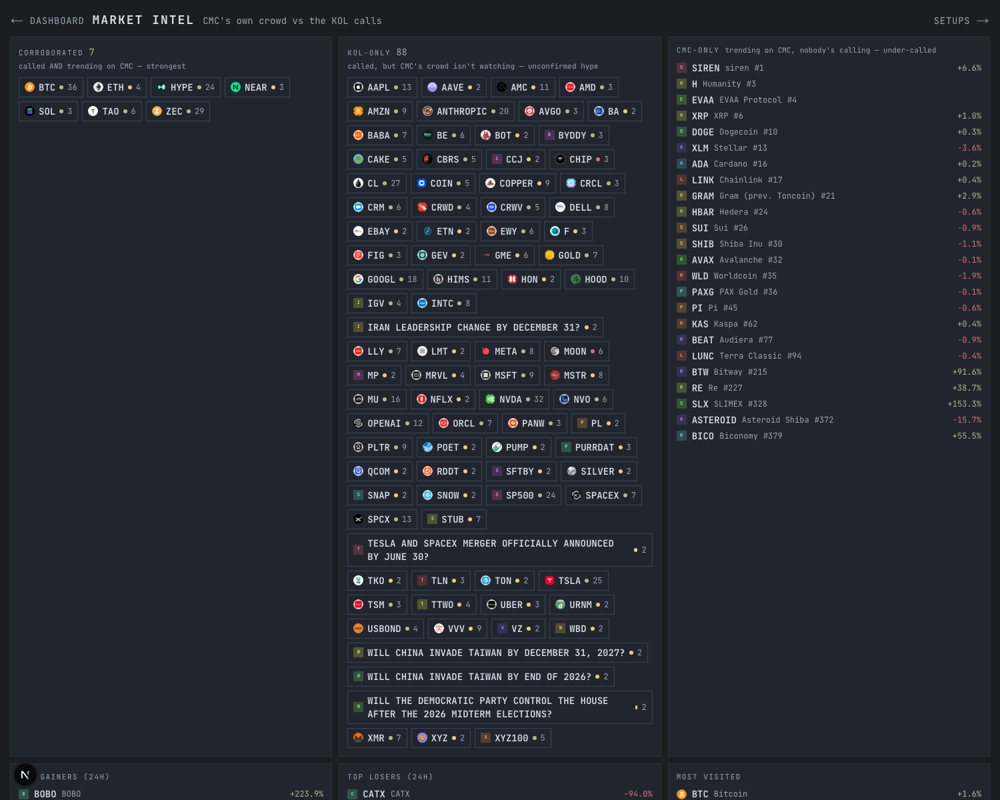
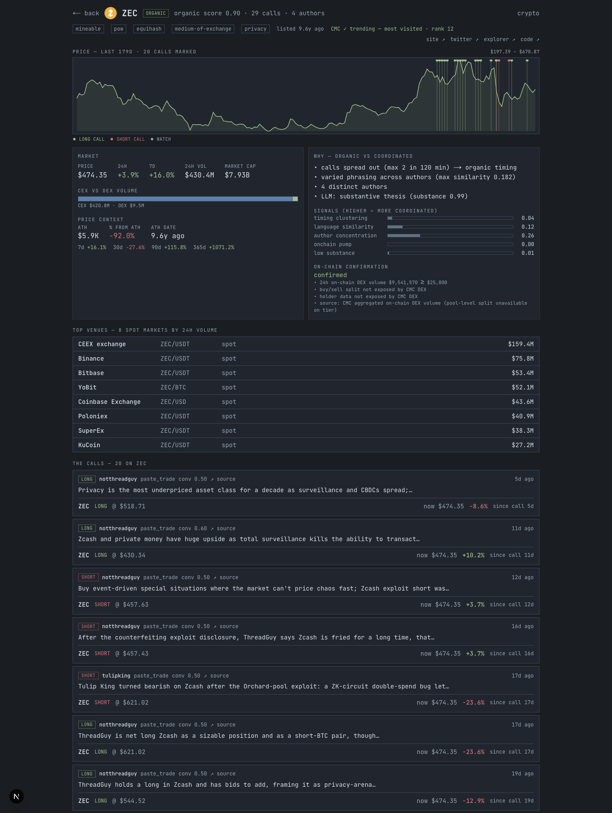

# Public Alpha — a CoinMarketCap Strategy Skill

> **BNB HACK · Track 2 (Strategy Skills).** A CMC Skill that filters crypto hype into a
> **backtestable strategy spec** — it extracts specific token *calls*, separates the ones
> growing **organically** from **coordinated pumps**, confirms with **on-chain** flow,
> gates by **regime**, and emits a transparent, backtested spec. No live execution, no real money.

**Targeting:** Track 2 placement + the stackable **"Best Use of CoinMarketCap Data"** special prize.

---

## The edge — why this isn't "just sentiment"

Sentiment tools score aggregate bullish/bearish *mood*. Plenty exist. The valuable, hard skill
in crypto is different: **extract the specific calls** people are making, **tell an organically
growing thesis apart from a coordinated pump**, and **only act when on-chain flow confirms it** —
then express that as a transparent, backtested strategy. That separation is the wedge, and it's
packaged here as a reusable CMC Skill.

## The 5-stage funnel

```
 1. NARRATIVE        2. CALL          3. ORGANIC vs        4. ON-CHAIN        5. REGIME
    HEATING       →  EXTRACTION    →   COORDINATED      →  CONFIRMATION    →  GATE          →  SPEC + CARD
 which sectors      per-token         ★ the wedge ★        is money            risk-on?         + BACKTEST
 are heating up     calls + stance    timing / language    actually moving?    F&G / dominance
 (CMC community)    (paste.trade+CMC) / authors / pump      (CMC DEX)           / altseason
```

Each run emits three artifacts (schemas in [`docs/PRDs/01/output-contract.md`](docs/PRDs/01/output-contract.md)):
**Strategy Spec (JSON)** · **Strategy Card (Markdown)** · **Backtest Report (JSON)**.

## ★ The classifier (the differentiator)

Deterministic features + a structured substance/language judgment, fused into
`{organic | coordinated | mixed}` + a 0–1 score + **human-readable reasons**:

| feature | signal |
|---|---|
| **timing clustering** | many calls jammed in a tight window → coordinated |
| **language similarity** | near-identical copypasta across authors (char-3gram Jaccard) → coordinated |
| **author diversity** | few / low-credibility accounts repeating → coordinated |
| **on-chain cross-check** | price spiking on thin liquidity → pump tell |
| **substance** (LLM) | pure urgency ("100x", "last chance") vs a real thesis |

Worked examples it ships with (run `tests/test_wedge.py`):

```
CAKE  → ORGANIC     (0.96)   spread over days · 5 distinct authors · varied substantive theses
$MOON → COORDINATED (0.13)   6 calls in 38 min · Jaccard 1.0 copypasta · low-follower accounts · pure urgency
```

…and on **real** data: BTC's 36 calls from 10 distinct authors over months → **organic**.

## How CoinMarketCap data is used

| CMC data family | Funnel stage |
|---|---|
| Community trending topics | Narrative heating |
| Cryptocurrency categories + performance | Narrative heating |
| Content (news + posts, engagement) | Call extraction |
| DEX on-chain (liquidity, buy/sell) | On-chain confirmation |
| Global metrics + Fear & Greed | Regime gate |
| OHLCV historical | Backtest |
| Trending (most-visited, gainers/losers) + community trending tokens | **Attention cross-ref** — does CMC's crowd corroborate the calls? |
| Metadata (logo, tags, links, listing date) | Asset identity + provenance + "new token" flag |
| Price performance (ATH, % from ATH, ROI ladder) | Price context (early vs late) |
| Market pairs (top spot venues) | CEX/DEX venue breakdown |
| Altcoin Season Index + F&G history | Regime gate (real index + trend, not a proxy) |

CMC is the data spine via the REST Pro API (deterministic path) and the [CMC MCP](https://coinmarketcap.com/api/mcp) (the agent's exploration + narration).

## The scanner (terminal UI)

One command sweeps the whole call universe and opens a navigable TUI (Textual) — a **Signals** feed
(every asset being called, ranked by volume, with the organic/coordinated verdict) and a **Trade Ideas**
view (the confirmed subset + a gate scoreboard), with a detail pane showing the social evidence.

```bash
./skills/public-alpha/scan      # scan + open the TUI  ·  ↑↓ navigate · Enter detail · 1/2 tabs · r rescan · q quit
```




Under the hood: `scan.py` → `results/scan.json` → `scan_tui.py`. The single-asset deep-dive
(`run.py --symbol X`) emits the full Spec + Card + Backtest.

## Web dashboard (SMUI / shadcn)

A browser dashboard over the same `scan.json` — a hot-assets top bar, a social-trades feed (calls /
asset rows / grouped, switchable) and a Trade Ideas panel. Next.js + Tailwind + shadcn/ui + the SMUI
terminal theme.

```bash
cd web && npm install && npm run scan:dev   # scans, then opens http://localhost:3000
```

It has a market-insights panel (total/DeFi volume, dominance, **real altcoin-season index**, F&G trend,
CEX-vs-DEX split), the hot-assets bar (with a **CMC ✓** marker when CMC's own crowd corroborates a call),
the 3-mode social feed, and a Trade Ideas panel.

Two more views deepen each asset/thesis:

- **Market Intel** (`/intel`) — *CMC's own crowd vs the KOL calls*: **corroborated** (called + trending on
  CMC), **KOL-only** (unconfirmed hype), **CMC-only** (trending but under-called); market movers
  (gainers/losers/most-visited); and a regime panel (altcoin-season index, F&G 14-day trend, dominance).
- **Asset thesis** (`/asset?symbol=X`) — logo, tags, listing age + "NEW" flag, provenance links, the
  CMC-attention line, a **price chart with call markers** (where each call landed, colored by stance),
  market stats + CEX/DEX split, **price context** (ATH, % from ATH, ROI ladder), **top venues**, the
  classifier breakdown, and the full call feed rendered paste.trade-style — each call a LONG/SHORT thesis
  card with its **entry price and % move since the call**.





## Data sources & access (honest)

- **CMC** — the spine. The widest set of families above.
- **paste.trade** — real KOL calls, accessed via the operator's **explicitly public surface only**
  (`/api/shows/{all-in,threadguy}`, allowed by their `robots.txt`; show trades are designated public).
  We do **not** touch the gated bulk corpus API (`/api/trades`, `/api/feed`) or circumvent their
  read-gate. Content signals respected (`ai-train=no` — we don't train). If the surface changes, the
  adapter degrades gracefully.
- **Seed set** — a small, curated, **paraphrased** set of real-shaped calls (one organic + one
  coordinated cluster) so the classifier is demonstrable and deterministic offline.
- Evidence is always kept to short paraphrases (copyright).

## Honesty (what's backtested vs forward-validated)

The backtest replays only what has real history — **price/OHLCV**. The call layer, the
organic-vs-coordinated classification, on-chain confirmation and the regime gate are **live /
forward-validated** signals, not replayed; the backtested entry is a disclosed momentum *proxy*.
Every Backtest Report carries a mandatory `honesty` block stating exactly this. We'd rather show a
credible curve than a suspiciously perfect one.

## Run it

```bash
pip install -r requirements.txt
cp .env.example .env            # add CMC_PRO_API_KEY (paid tier); PASTE_TRADE_TOKEN optional

# the funnel for one token (works offline on seed + paste.trade allowed surface):
python3 skills/public-alpha/scripts/run.py --symbol CAKE
python3 skills/public-alpha/scripts/run.py --symbol BTC --sources paste_trade
python3 skills/public-alpha/scripts/run.py --replay        # narrate the cached run

# the classifier self-test (offline, deterministic):
python3 skills/public-alpha/tests/test_wedge.py
```

With a CMC key set, on-chain confirmation, the regime gate, narrative heating, and the backtest
light up. The agent drives the whole funnel via [`skills/public-alpha/SKILL.md`](skills/public-alpha).

## Architecture

```
skills/public-alpha/
├── SKILL.md                  # the agent's runbook: the funnel, narrated
├── scripts/
│   ├── models.py             # contract types (pydantic v1)
│   ├── sources/              # base protocols · cmc · paste_trade · seed (+ stubs)
│   ├── calls.py              # normalize candidates -> resolved, scored calls
│   ├── classifier.py         # ★ organic vs coordinated
│   ├── confirm.py            # on-chain confirmation gate
│   ├── regime.py             # Fear&Greed / dominance / altseason gate
│   ├── strategy.py           # assemble the Strategy Spec
│   ├── backtest.py           # numpy event backtest + honesty block
│   ├── render.py             # Spec JSON · Strategy Card MD · Report JSON writers
│   └── run.py                # funnel CLI
├── tests/test_wedge.py       # offline classifier check
├── config/default.yaml       # tunable thresholds
└── examples/                 # committed golden run (proof of execution)
```

Built on the official CMC skills pattern (`cmc-mcp`, `cmc-api-dex`, `cmc-api-market`) — we extend it, not reinvent it.

## License

MIT — see [LICENSE](LICENSE).

---

_Status: the full funnel runs live on CMC data — classifier, calls (paste.trade + CMC + seed),
confirmation, regime gate, and a 180-day backtest. **Works for any asset.** Search a ticker *or company
name* and it resolves to a unified entity — a crypto, or one of CMC's **400+ tokenized stocks across
chains** (xStock/Ondo/bStocks on Ethereum, Solana, BNB Chain) — then unifies the calls (paste.trade
ticker + CMC posts) and runs the funnel. The classifier is asset-agnostic; **confirmation is
asset-aware** — on-chain DEX flow for crypto, market volume for tokenized stocks/others, honest "no
data (pluggable)" otherwise. Committed golden run in [`skills/public-alpha/examples/`](skills/public-alpha/examples/):
`tsla/` (Tesla tokenized stock → TSLAX, +24.8% excess vs BNB), `cake/` (BNB crypto, on-chain confirmed,
+31.6% excess), `pepe/` (calls sourced entirely from CMC), `moon/` (a coordinated pump, filtered).
Remaining before the lock: demo video + DoraHacks submission (repo public)._
