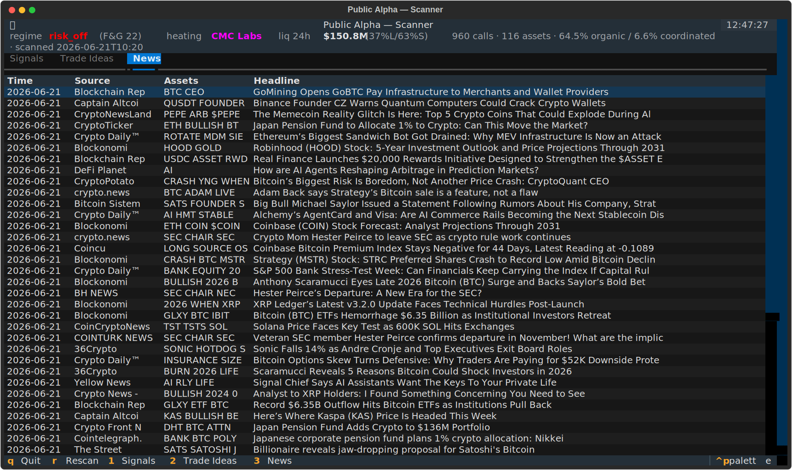
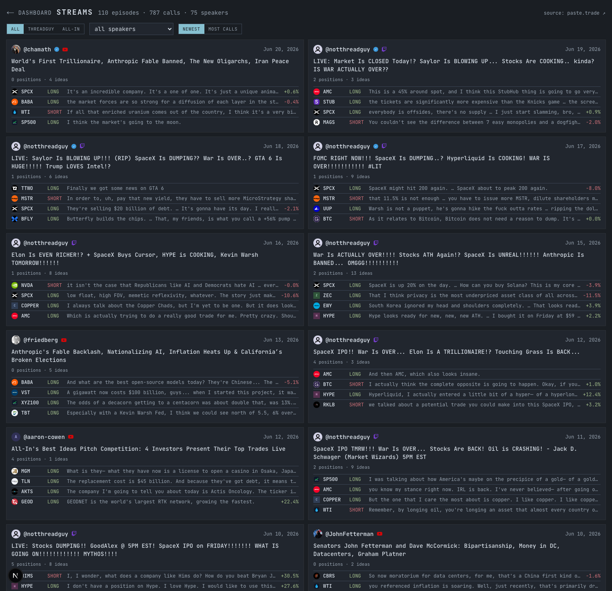
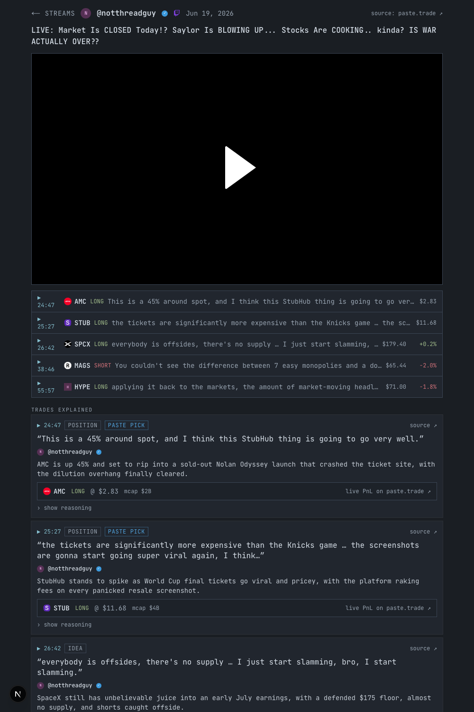
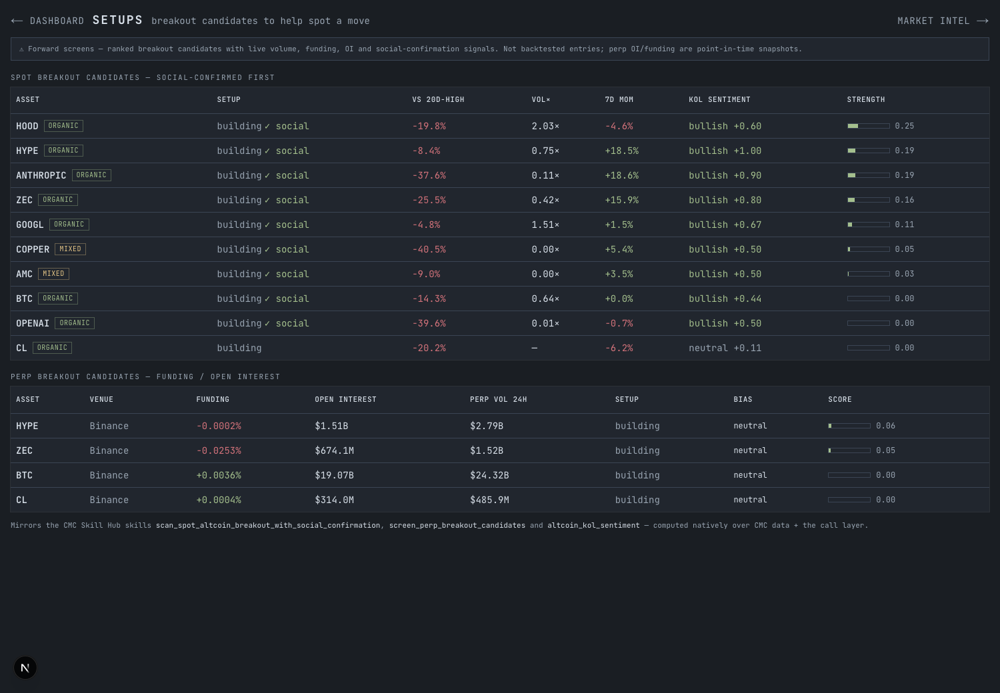

<div align="center">

# Public Alpha

**A social-signal scanner for crypto, built as a CoinMarketCap Strategy Skill.**

Follow the trades other traders are calling across social — filtered for coordinated noise, cross-referenced against CMC's own crowd, and confirmed on-chain.

[What it does](#what-it-does)&nbsp; ·&nbsp; [The funnel](#the-5-stage-funnel)&nbsp; ·&nbsp; [Classifier](#-the-classifier-the-differentiator)&nbsp; ·&nbsp; [CMC data](#how-coinmarketcap-data-is-used)&nbsp; ·&nbsp; [Terminal scanner](#the-scanner-terminal-ui)&nbsp; ·&nbsp; [Web dashboard](#web-dashboard-smui--shadcn)&nbsp; ·&nbsp; [Data sources](#data-sources--access-honest)&nbsp; ·&nbsp; [Honesty](#honesty-whats-backtested-vs-forward-validated)&nbsp; ·&nbsp; [Run it](#run-it)

</div>

> **BNB HACK · Track 2 (Strategy Skills).** Follow the most socially active trades — what
> traders across **Twitch / X / YouTube** and the **CMC community** are actually calling right
> now — ranked, deduped, **filtered for coordinated noise**, and **cross-referenced against CMC's
> own crowd**. Then act only when on-chain flow confirms it, and emit a transparent, backtested
> strategy spec. CoinMarketCap is the data spine. No live execution, no real money.

---

## What it does

Other traders are calling tokens all day across social. **Public Alpha follows those calls** and
turns the noise into a signal you can act on:

1. **Discover** — sweep the specific token *calls* traders are making across social (paste.trade
   KOL shows on Twitch/X/YouTube + CMC community posts + CMC news) and rank what's heating up.
2. **Filter the noise** — tell a call growing **organically** apart from a **coordinated pump**
   (the classifier below) so you follow conviction, not copypasta.
3. **Cross-reference the crowd** — check the calls against **CMC's own crowd** (most-visited,
   gainers, trending), confirm with **on-chain** flow, and gate by **regime**.
4. **Act** — surface it in a terminal scanner + web dashboard, and emit a backtestable
   **Strategy Spec / Card / Backtest** for any asset.

## The 5-stage funnel

```
 1. NARRATIVE        2. CALL          3. ORGANIC vs        4. ON-CHAIN        5. REGIME
    HEATING       →  EXTRACTION    →   COORDINATED      →  CONFIRMATION    →  GATE          →  SPEC + CARD
 which sectors      per-token         ★ the wedge ★        is money            risk-on?         + BACKTEST
 are heating up     calls + stance    timing / language    actually moving?    F&G / dominance
 (CMC community)    (paste.trade+CMC) / authors / pump      (CMC DEX)           / altseason
```

Each run emits three artifacts (schemas in [`docs/PRDs/01/output-contract.md`](docs/PRDs/01/output-contract.md)):
**Strategy Spec (JSON)** · **Strategy Card (Markdown)** · **Backtest Report (JSON)**.

## ★ The classifier (the differentiator)

Deterministic features + a structured substance/language judgment, fused into
`{organic | coordinated | mixed}` + a 0–1 score + **human-readable reasons**:

| feature | signal |
|---|---|
| **timing clustering** | many calls jammed in a tight window → coordinated |
| **language similarity** | near-identical copypasta across authors (char-3gram Jaccard) → coordinated |
| **author diversity** | few / low-credibility accounts repeating → coordinated |
| **on-chain cross-check** | price spiking on thin liquidity → pump tell |
| **substance** (LLM) | pure urgency ("100x", "last chance") vs a real thesis |

Worked examples it ships with (run `tests/test_wedge.py`):

```
CAKE  → ORGANIC     (0.96)   spread over days · 5 distinct authors · varied substantive theses
$MOON → COORDINATED (0.13)   6 calls in 38 min · Jaccard 1.0 copypasta · low-follower accounts · pure urgency
```

…and on **real** data: BTC's 36 calls from 10 distinct authors over months → **organic**.

## How CoinMarketCap data is used

| CMC data family | Funnel stage |
|---|---|
| Community trending topics | Narrative heating |
| Cryptocurrency categories + performance | Narrative heating |
| Content (news + posts, engagement) | Call extraction |
| Content — market-wide news feed (all CMC-listed assets) | **News tab / feed** + per-asset articles |
| Community posts (top, by engagement) | **Community pulse** — who's talking, per asset |
| DEX on-chain (liquidity, buy/sell) | On-chain confirmation |
| Liquidations (global + per-coin, 24h) | **Leverage read** — squeeze fuel vs cascade risk + market-wide long/short flush |
| Global metrics + Fear & Greed | Regime gate |
| OHLCV historical | Backtest |
| Trending (most-visited, gainers/losers) + community trending tokens | **Attention cross-ref** — does CMC's crowd corroborate the calls? |
| Metadata (logo, tags, links, listing date) | Asset identity + provenance + "new token" flag |
| Price performance (ATH, % from ATH, ROI ladder) | Price context (early vs late) |
| Market pairs (top spot venues) | CEX/DEX venue breakdown |
| Altcoin Season Index + F&G history | Regime gate (real index + trend, not a proxy) |
| Derivatives perp funding / open interest | **Perp breakout screen** (Skill Hub `screen_perp_breakout_candidates`) |
| OHLCV + the call layer | **Spot breakout + social confirmation** + **KOL sentiment** (Skill Hub) |

CMC is the data spine via the REST Pro API (deterministic path) and the [CMC MCP](https://coinmarketcap.com/api/mcp) (the agent's exploration + narration).

## The scanner (terminal UI)

One command sweeps the whole call universe and opens a navigable TUI (Textual) — three tabs: a
**Signals** feed (every asset being called, ranked by volume, with the organic/coordinated verdict),
a **Trade Ideas** view (the confirmed subset + a gate scoreboard), and a **News** feed (market-wide
CMC headlines). The detail pane mirrors the web dashboard — the social evidence plus **leverage &
liquidations** (perp funding + realized long/short flushes, a squeeze-vs-cascade read) and the **CMC
community** (top posts + articles). A top bar carries the regime + market-wide 24h liquidations.

```bash
./skills/public-alpha/scan      # scan + open the TUI  ·  ↑↓ navigate · Enter detail · 1/2/3 tabs · r rescan · q quit
```




Under the hood: `scan.py` → `results/scan.json` → `scan_tui.py`. The single-asset deep-dive
(`run.py --symbol X`) emits the full Spec + Card + Backtest.

## Web dashboard (SMUI / shadcn)

A browser dashboard over the same `scan.json` — a hot-assets top bar, a 5-mode social-trades feed
(timeline / calls / asset rows / grouped / news, switchable) and a Trade Ideas panel. Next.js +
Tailwind + shadcn/ui + the SMUI terminal theme.

```bash
cd web && npm install && npm run scan:dev   # scans, then opens http://localhost:3000
```

It has a market-insights panel (total/DeFi volume, dominance, **real altcoin-season index**, F&G trend,
CEX-vs-DEX split), the hot-assets bar (with a **CMC ✓** marker when CMC's own crowd corroborates a call),
the 5-mode social feed, and a Trade Ideas panel.

Four more views deepen each asset/thesis:

- **Streams** (`/streams` · `/stream?id=` · `/speaker?handle=`) — a paste.trade-style browser of the source
  shows: an episode index (filter by show/speaker), a **stream page** (embedded Twitch/YouTube player +
  the calls at their in-stream timestamps + "trades explained" cards) and **speaker profiles** (their calls
  + L/S + verified). Each call links to its CMC `/asset` thesis. The same data is on the CLI via
  `paste_browse.py` (`--shows`/`--list`/`--stream`/`--speaker`). Content is paste.trade's, shown with credit.
- **Setups** (`/setups`) — the *decide / predict a move* surface: **spot breakout candidates** (Donchian
  20-day-high + volume + **social confirmation**) and **perp breakout candidates** (funding / open interest
  on major venues + bias). Native re-implementations of the CMC Skill Hub skills
  `scan_spot_altcoin_breakout_with_social_confirmation`, `screen_perp_breakout_candidates` and
  `altcoin_kol_sentiment` — forward screens, not backtested.
- **Market Intel** (`/intel`) — *CMC's own crowd vs the KOL calls*: **corroborated** (called + trending on
  CMC), **KOL-only** (unconfirmed hype), **CMC-only** (trending but under-called); market movers
  (gainers/losers/most-visited); **market-wide 24h liquidations** (long/short split); and a regime panel
  (altcoin-season index, F&G 14-day trend, dominance).
- **Asset thesis** (`/asset?symbol=X`) — logo, tags, listing age + "NEW" flag, provenance links, the
  CMC-attention line, a **price chart** (shadcn/Recharts) where each **KOL call lands as an avatar dot on
  the line** (colored by stance, clustered, hover for the thesis) with a **range selector**
  (1D/7D/1M/3M/1Y/ALL), market stats + CEX/DEX split, **price context** (ATH, % from ATH, ROI ladder),
  **decision signals** (KOL sentiment gauge · spot breakout · perp funding/OI + a funding-implied
  **long/short lean** bar), **top venues — spot and perp (CEX + DEX)**, a **leverage & liquidations** card
  (squeeze-vs-cascade read), the **CMC community** (top posts + news articles), the classifier breakdown,
  and the full call feed rendered paste.trade-style — each call a LONG/SHORT thesis card with its **entry
  price and % move since the call**.







## Data sources & access (honest)

- **CMC** — the spine. The widest set of families above.
- **paste.trade** — real KOL calls, accessed via the operator's **explicitly public surface only**
  (`/api/shows/{all-in,threadguy}`, allowed by their `robots.txt`; show trades are designated public).
  We do **not** touch the gated bulk corpus API (`/api/trades`, `/api/feed`) or circumvent their
  read-gate. Content signals respected (`ai-train=no` — we don't train). If the surface changes, the
  adapter degrades gracefully.
- **Seed set** — a small, curated, **paraphrased** set of real-shaped calls (one organic + one
  coordinated cluster) so the classifier is demonstrable and deterministic offline.
- **Attribution.** In the funnel/dashboard, social evidence is kept to short (≤15-word) paraphrases. The
  **Streams browser** (`/streams`, `paste_browse.py`) reproduces paste.trade's public show content more
  fully (titles, quotes, reasoning, the embedded source video) — and every stream/speaker/call view carries
  a **"source: paste.trade"** credit and links back to the show + the source video. Nothing comes from the
  gated surface.

## Honesty (what's backtested vs forward-validated)

The backtest replays only what has real history — **price/OHLCV**. The call layer, the
organic-vs-coordinated classification, on-chain confirmation and the regime gate are **live /
forward-validated** signals, not replayed; the backtested entry is a disclosed momentum *proxy*.
Every Backtest Report carries a mandatory `honesty` block stating exactly this. We'd rather show a
credible curve than a suspiciously perfect one.

## Run it

```bash
pip install -r requirements.txt
cp .env.example .env            # add CMC_PRO_API_KEY (paid tier); PASTE_TRADE_TOKEN optional

# the funnel for one token (works offline on seed + paste.trade allowed surface):
python3 skills/public-alpha/scripts/run.py --symbol CAKE
python3 skills/public-alpha/scripts/run.py --symbol BTC --sources paste_trade
python3 skills/public-alpha/scripts/run.py --replay        # narrate the cached run

# the classifier self-test (offline, deterministic):
python3 skills/public-alpha/tests/test_wedge.py
```

With a CMC key set, on-chain confirmation, the regime gate, narrative heating, and the backtest
light up. The agent drives the whole funnel via [`skills/public-alpha/SKILL.md`](skills/public-alpha).

## Architecture

```
skills/public-alpha/
├── SKILL.md                  # the agent's runbook: the funnel, narrated
├── scripts/
│   ├── models.py             # contract types (pydantic v1)
│   ├── sources/              # base protocols · cmc · paste_trade · seed (+ stubs)
│   ├── calls.py              # normalize candidates -> resolved, scored calls
│   ├── classifier.py         # ★ organic vs coordinated
│   ├── decide.py             # decision skills: KOL sentiment · spot/perp breakout (CMC Skill Hub, native)
│   ├── confirm.py            # on-chain confirmation gate
│   ├── regime.py             # Fear&Greed / dominance / altseason gate
│   ├── strategy.py           # assemble the Strategy Spec
│   ├── backtest.py           # numpy event backtest + honesty block
│   ├── render.py             # Spec JSON · Strategy Card MD · Report JSON writers
│   ├── scan.py               # whole-universe scan -> results/scan.json (dashboard data)
│   ├── paste_browse.py       # paste.trade browser data + CLI -> results/paste.json (streams/speakers/calls)
│   └── run.py                # funnel CLI
├── tests/{test_wedge,test_decide}.py   # offline classifier + decision-skill checks
├── config/default.yaml       # tunable thresholds
└── examples/                 # committed golden run (proof of execution)
```

Built on the official CMC skills pattern (`cmc-mcp`, `cmc-api-dex`, `cmc-api-market`) — we extend it, not reinvent it.

## License

MIT — see [LICENSE](LICENSE).

---

_Status: the full funnel runs live on CMC data — classifier, calls (paste.trade + CMC + seed),
confirmation, regime gate, and a 180-day backtest. **Works for any asset.** Search a ticker *or company
name* and it resolves to a unified entity — a crypto, or one of CMC's **400+ tokenized stocks across
chains** (xStock/Ondo/bStocks on Ethereum, Solana, BNB Chain) — then unifies the calls (paste.trade
ticker + CMC posts) and runs the funnel. The classifier is asset-agnostic; **confirmation is
asset-aware** — on-chain DEX flow for crypto, market volume for tokenized stocks/others, honest "no
data (pluggable)" otherwise. Committed golden run in [`skills/public-alpha/examples/`](skills/public-alpha/examples/):
`tsla/` (Tesla tokenized stock → TSLAX, +24.8% excess vs BNB), `cake/` (BNB crypto, on-chain confirmed,
+31.6% excess), `pepe/` (calls sourced entirely from CMC), `moon/` (a coordinated pump, filtered).
Remaining before the lock: demo video + DoraHacks submission (repo public)._
